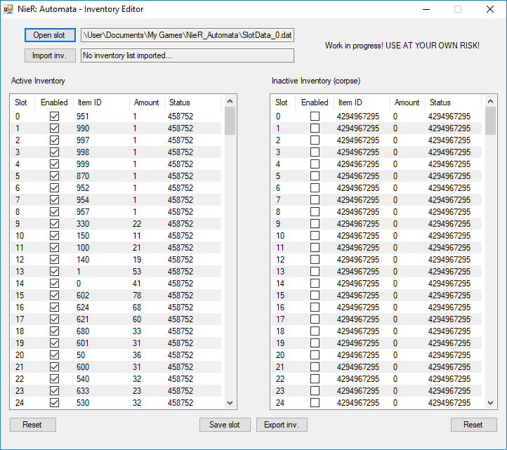

# NieR: Automata - Inventory Editor
**Work in progress** inventory editor for NieR:Automata. For use with this fantastic resource: https://docs.google.com/spreadsheets/d/1HQc9XkppRgNEFQ5zLgQW6BTqyFrPf2P6DxKz8x2S2oU/

**MAKE BACKUPS BEFORE USING THIS!**

Please be aware that I am making random assumptions while creating this editor, which might or might not be true. For example, the "inactive/corpse" inventory is something I haven't actually spent much time to verify. It was, however, the only explanation I could come up with why the 512 inventory block suddenly split in two at the half of it.

## Features

* Edit your inventory "easily".
* Export/import inventory lists between saves or players.

## Requirement

* .NET Framework 4

## Usage

1. Download the editor from [the release section](https://github.com/Idearum/NieRAutomata_Inventory_Editor/releases).

2. Run the tool and open one of the slot data files of NieR:Automata:

   - **SlotData_0.dat** - save slot #1
   - **SlotData_1.dat** - save slot #2
   - **SlotData_2.dat** - save slot #3

3. Double click on a cell to change the value of it.

4. Use this Google spreadsheet to locate the appropriate item ID to add new items: https://docs.google.com/spreadsheets/d/1HQc9XkppRgNEFQ5zLgQW6BTqyFrPf2P6DxKz8x2S2oU/

5. Click on **Save slot** to save your changes to the slot data file.

## The "Status" column

This is the actual "status" value stored for the item slot in the file, in decimal, of course. The **Enabled** column is a wrapper around this, that shows *true* if Status == 458752, or *false* if different.

The reason for this is because I still haven't fully figured that section of the item slot out. For now 458752 seems to be an "active" item slot, while 4294967295 is an inactive one, however this assumption might be wrong. Therefor the Status column is exposed where the actual value of the item slot can be shown and edited if necessary.

## Known Issues

* No telling what havoc this editor can cause.

* The value in the Status column will be set to 9999,9999 if trying to edit an unused/disabled item slot. This is because the ObjectListView module I am using can't handle values above 9999,9999, so an out of range exception is thrown. The issue can be worked around by enabling/disabling the item slot using the Enabled column instead.

## License

The code for the editor is covered by [LICENSE](LICENSE).

Uses [ObjectListView](http://objectlistview.sourceforge.net/cs/index.html), which is licensed as [GNU GPLv3](https://sourceforge.net/p/objectlistview/code/HEAD/tree/cs/branches/v2.3/COPYING).
